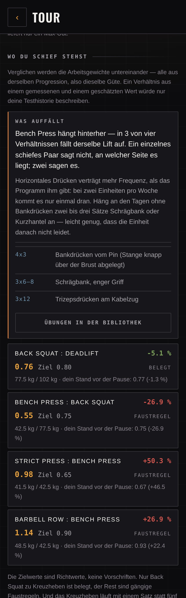
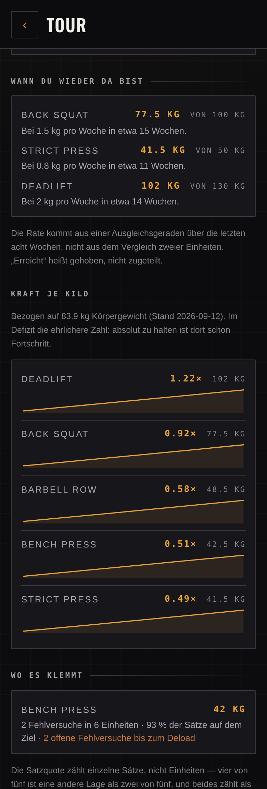
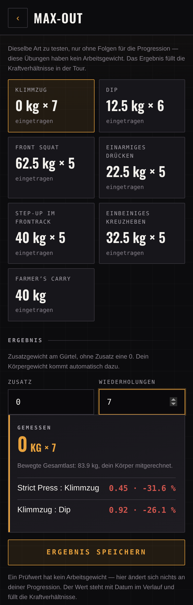
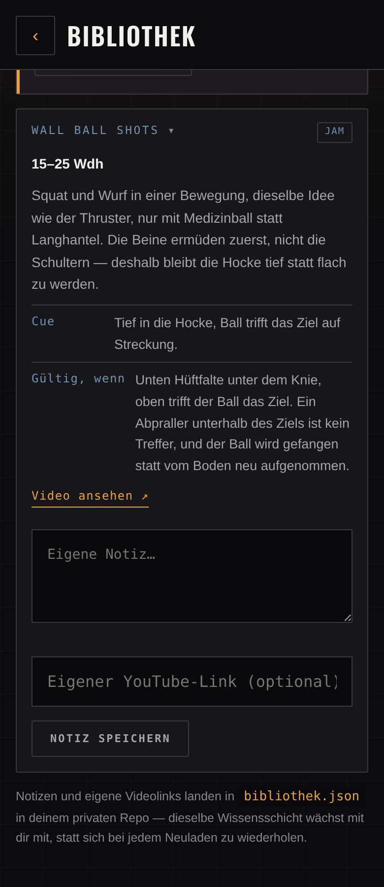

<p align="center">
  
</p>

<p align="center">
  <a href="https://cyphomat.github.io/setlist/"></a>
  
  
  
</p>

<p align="center">
  <b>A training planner for one person.</b><br>
  Twice strength, twice bike per week. The week is a setlist.
</p>

<p align="center">
  <sub>100% vibe coded. Use at your own risk. Feature requests welcome.</sub>
</p>

<p align="center">
  <b>English</b> · <a href="README.md">Deutsch</a> · <a href="CHANGELOG.md">Changelog</a>
</p>

> **Note on language.** The app's interface is available in German and English — switch it under **Tour → Backstage → Language**. The *training content* is still German only: the call before a session, exercise explanations, cues, mistakes, jam movements and the bike rationales. Those are technical text that needs to be translated properly rather than word-for-word, so they were deliberately left alone for now. Expect a mixed-language screen when you run the app in English.

---

## What it looks like

<table>
<tr>
<td width="33%"></td>
<td width="33%"></td>
<td width="33%"></td>
</tr>
<tr>
<td align="center"><b>The call</b><br><sub>Tone from layoff, form and bike</sub></td>
<td align="center"><b>In the gym</b><br><sub>Plates, cadence, sets above target</sub></td>
<td align="center"><b>Afterwards</b><br><sub>The win first, the report second</sub></td>
</tr>
</table>

**On a Mac it becomes an overview** — calendar, weekly load, personal bests and trend curves side by side instead of stacked:


**And this is how you set it up** — the app asks, instead of making you write a JSON file:

<table>
<tr>
<td width="33%"></td>
<td width="33%"></td>
<td width="33%"></td>
</tr>
<tr>
<td align="center"><b>First-time setup</b><br><sub>Bar, lifts, training days</sub></td>
<td align="center"><b>Your voice</b><br><sub>Reason, own lines, old bests</sub></td>
<td align="center"><b>Places and equipment</b><br><sub>What is where</sub></td>
</tr>
</table>

**And this is what it tells you about your strength** — not just how much, but where it is out of balance:

<table>
<tr>
<td width="25%"></td>
<td width="25%"></td>
<td width="25%"></td>
<td width="25%"></td>
</tr>
<tr>
<td align="center"><b>Where you are out of balance</b><br><sub>The same lift in several pairs = the cause</sub></td>
<td align="center"><b>When you are back</b><br><sub>Projection, strength per kilo, plateaus</sub></td>
<td align="center"><b>Test values</b><br><sub>Measured in a max-out, not typed</sub></td>
<td align="center"><b>Counts when</b><br><sub>When the rep is valid</sub></td>
</tr>
</table>

<sub>Real screens with sample data, captured via <code>tools/shot.html</code> and <code>tools/shots.mjs</code>. Not mockups.</sub>

---

## What it tells you

The difference from a logbook: it has an opinion about today — from data, not from a gut feeling.

- **The call** reads training layoff, outstanding failed attempts, current streak and form from the bike, and decides between `TECHNIK`, `SOLIDE`, `HART` and `SCHWER` — then asks after the session how it actually felt. That keeps the call verifiable instead of merely asserted.
- **HRV and sleep take priority.** If HRV drops well below your own average of recent days, or the night was too short, the app calls TECHNIK — even when the plan or outstanding failures would suggest otherwise. Both see something raw training load does not capture.
- **Interference warning** when a hard ride was less than four hours ago — the last sets get sluggish, maximal strength itself is untouched.
- **Milestones** know your old bests including the date:

  > **From your history** — Yesterday five years ago: 140 kg back squat. Today you are at 65 kg — not because you can do less, but because you are starting again.

- **Small wins** come first after every session. Not the report, but what you achieved.
- **The voice** mixes your own lines with 52 built-in ones, roughly half and half. Editable under **Tour → Backstage → Your voice** — that is also where *your reason* lives, which only shows up on the hard days.

## How it fits together

```
Zwift ──▶ Strava ──▶ intervals.icu ◀──▶ Setlist ◀──▶ setlist-data (private)
                            │                              │
                       rides, form                 strength progression
```

Setlist owns the **strength** progression — two systems computing the same working weight inevitably drift apart. The **bike** runs the other way: it arrives automatically via Zwift → Strava → intervals.icu, Setlist only shows it as a hint and in return writes every strength session back, so fitness and fatigue live in one curve instead of two separate worlds.

That way back deliberately waits until the next app start: the Apple Watch often detects strength training by heart rate itself and forwards it via Strava with a delay. An immediate push would usually beat it there and the same session would count twice in fitness and fatigue.

## Twice and twice

5×5 was originally built for three sessions a week. At two at most the same mechanics apply, just slower — the 60% rule for coming back would have meant six to nine weeks below the stimulus threshold at this frequency, so it is 80% instead.

|  | Lift 1 | Lift 2 | Lift 3 |
|---|---|---|---|
| **Workout A** | Back Squat 5×5 | Bench Press 5×5 | Barbell Row 5×5 |
| **Workout B** | Back Squat 5×5 | Strict Press 5×5 | Deadlift 1×5 |

Back squat is in both workouts and therefore climbs twice as fast.

---

## Features

### Strength

| | |
|---|---|
| **5×5 automation** | Progression, failure counter, deload to 90% after three failed attempts. |
| **Plate calculator** | Plates per side. Weights that cannot be loaded exactly are named rather than rounded. |
| **Soundcheck** | Warm-up sets derived from the working weight: empty bar, then 55 / 70 / 85%. Every line tickable — tapped means struck through. |
| **Weight mid-set** | Adjustable during the session — the log reflects what actually happened. |
| **Rest timer** | 90 s, 180 s after a failed attempt, adjustable by ±30 s while running. Ends with vibration and a tone, stops itself after the session's last set. |
| **Personal bests** | `Max` (only from a max-out) versus `At least` (from working sets, systematically too low). |
| **Max-out** | Strength test with e1RM. Does not advance the A/B rotation. |
| **Knowledge at the bar** | Expandable: rationale, cue, typical mistake, bridge to olympic lifting. |
| **Mobility** | Five exercises, due once per calendar week — at the first session (strength or jam), whichever comes first. Own button, usable independently at any time. |
| **Feel after the session** | Four levels (easy/normal/hard/brutal) on the done screen — makes the call verifiable in hindsight. |
| **Call vs. feel** | In the Tour: every session with both values plus the hit rate — the call and the perceived effort side by side instead of merely asserted. |
| **Where you are out of balance** | Twelve strength ratios against guidance values *and* against your own level before the layoff. When the same lift stands out in several pairs, the app names it as the cause and suggests extra work — a single skewed pair does not tell you which side causes it. Only values of equal quality are compared. |
| **Test values** | Pull-up, dip, front squat, single-arm press, step-up, single-leg deadlift and farmer’s carry — what 5×5 does not produce on its own. Enter them in the backstage or **measure them in a max-out**; a measured test beats a typed one and is recorded with its date. They add eight more ratios, including whether your pulling matches your pressing. |
| **When you are back** | A projection per lift from your actual rate of increase up to your pre-layoff weight. “Reached” means lifted, not assigned. |
| **Strength per kilo** | Working weight divided by body weight, with a trend line. In a deficit this is the honest number — holding steady is already progress. |
| **Where it is stuck** | Plateaus before the deload counter reports them: how long a weight has stood, failed attempts, and how many individual sets landed on target. |

### Bike and conditioning

| | |
|---|---|
| **Bike rides** | Rides, hours, kilometres, weekly load over twelve weeks — from intervals.icu. |
| **Training calendar** | 26 weeks as a grid: strength amber, jam green, bike steel blue. |
| **Stacked weekly load** | Strength and bike in one bar — the single curve that makes both belong together. |
| **Fitness vs. fatigue** | Two lines from intervals.icu — the area between them *is* your form. |
| **Recovery (HRV/sleep)** | From intervals.icu, usually via HealthFit out of Apple Health. HRV is judged only relative to your own baseline of recent days, never absolutely. Feeds into the call. |
| **Power targets** | From eFTP instead of percentages. |
| **Unplugged** | Fifteen minutes, bodyweight only, quiet if needed. Fixed intervals with a guided clock instead of rep counts — for the morning when someone is still asleep. Quiet mode drops everything that jumps and makes no sound, only vibration. |
| **Jam** | Five formats, 31 movements, loads from your current state. Never two barbell parts. |
| **Scaling** | Every movement names alternatives. “Can't do this” removes it for good. |

### App

| | |
|---|---|
| **Offline** | Sessions are buffered. Tour and bike view show the last known state. |
| **Self-updating** | Checks the version at start and reloads itself exactly once. |
| **Sound and vibration** | Tone at the end of a rest and on finishing a session, on top of the vibration — the tone respects the mute switch, the vibration does not. |
| **Light and dark** | Switch between system / light / dark. Two real designs, not an inversion. |
| **Text size** | Normal / Large / Extra large under *Backstage → Appearance*. Scales the whole interface evenly, on this device only. |
| **Phone and Mac** | Two columns from 900 px, wider grids in the Tour — same order, no rebuild. |
| **German and English** | Interface language switchable under Backstage. Training content stays German for now. |

### Library

| | |
|---|---|
| **Every exercise in one place** | Main lifts, technique, mobility, finishers and all jam movements, searchable and filterable by category. |
| **When the rep counts** | 60 exercises carry a movement standard written as a test, not a hint: not “squat deep” but “hip crease below the kneecap, hips and knees fully extended at the top”. Shown in the jam, in Unplugged and during a live session too. Stretches and time-based machines deliberately have none — there is no valid rep to judge. |
| **Always a random exercise** | With full detail at the top, drawn fresh on every visit — stays stable while you type or filter. |
| **YouTube search link instead of a guessed video** | A single hard-wired video could be offline or wrong. Overridable with your own link. |
| **Your own notes** | Land in `bibliothek.json` in `setlist-data` and grow with you — the same knowledge layer as `config.json`, but for what you learned yourself. |

---

### Setting up and adjusting

| | |
|---|---|
| **First-time setup** | No programme in the repo? Then the app asks: bar, the five lifts with a starting weight, strength days, optionally bike days — and writes a valid `config.json` from that. No JSON by hand. |
| **Your voice** | Your reason, your own lines and old personal bests, right in the app. The reason shows up on hard days, the bests on their anniversaries. |
| **Places and equipment** | Several gyms (home gym, box, studio …) each with their own kit. The jam only draws from what is there. With no places set up everything stays allowed. |
| **Place picker in the header** | A button shows where you are and switches places — on the home screen and in the jam. The picker lists how many jam movements are possible at each place. |
| **Update hint for forks** | A fork stays where it branched off. The app compares its version against the original's and says so once, with the way to update. |
| **Language** | Interface in German or English, switchable in the backstage. |

<p align="center">
  
</p>

<p align="center"><sub>The place picker from the header — with the number of jam movements possible there.</sub></p>

## Two decisions that carry the whole thing

**`state.json` is derived, not maintained.** It is a projection from `config.json` and every file in `einheiten/`. A mistyped entry never becomes a problem: fix the file, hit “rebuild state.json”, done. Working weights are never set directly — that is what the `anpassung` log type is for.

**“At least” is not “max”.** e1RM formulas assume proximity to failure; a 5×5 working set is submaximal, so the formula systematically underestimates there. That is why the trend curve does not mix the sources: a dashed line for lower bounds, max-outs as separate points.

---

## Setting it up yourself

Setlist is built for exactly one person — you. There is no multi-account login; whoever uses the app is whoever's `setlist-data` repo is configured. To get your own independent instance you need a GitHub account and about ten minutes.

**1 · Fork the app code**

Fork this repo (`cyphomat/setlist`) into your own GitHub account. That is the public part — code, nothing personal.

**2 · Create your own data repo**

Create a **private** repo called `setlist-data`. That is all — **no file by hand**. On
first open the app notices there is no programme yet and walks you through it: bar weight,
the five lifts with a starting weight (or one click on “start with the empty bar”),
strength days, optionally bike days. From that it writes a valid `config.json` into your
repo.

<p align="center">
  
</p>

If you would rather write it yourself, you still can — the file looks like this:

```json
{
  "bar": 20,
  "rounding": 2.5,
  "deload": { "afterFails": 3, "factor": 0.9 },
  "lifts": {
    "squat":    { "name": "Back Squat",   "increment": 2.5, "start": 40 },
    "bench":    { "name": "Bench Press",  "increment": 2.5, "start": 30 },
    "row":      { "name": "Barbell Row",  "increment": 2.5, "start": 30 },
    "ohp":      { "name": "Strict Press", "increment": 2.5, "start": 20 },
    "deadlift": { "name": "Deadlift",     "increment": 5.0, "start": 50 }
  },
  "workouts": {
    "A": [{ "lift": "squat", "sets": 5, "reps": 5 }, { "lift": "bench", "sets": 5, "reps": 5 }, { "lift": "row", "sets": 5, "reps": 5 }],
    "B": [{ "lift": "squat", "sets": 5, "reps": 5 }, { "lift": "ohp", "sets": 5, "reps": 5 }, { "lift": "deadlift", "sets": 1, "reps": 5 }]
  },
  "firstWorkout": "A",
  "rest": { "normal": 90, "afterFail": 180 },
  "plates": [25, 20, 15, 10, 5, 2.5, 1.25],
  "week": { "slots": [{ "day": 1, "type": "strength" }, { "day": 4, "type": "strength" }] }
}
```

`start` is your entry weight per lift, `increment` the step up after a successful session.
`week.slots` defines which weekdays have something scheduled (`day`: 1 = Monday …
7 = Sunday); bike slots (`"type": "ride"`) additionally need a `rides` array. If any of
that is missing the week overview simply stays empty — the rest of the app carries on.

Do **not** create `state.json` — the app derives the initial state from `config.json`
itself the first time and only writes it back after your first completed session. An empty
`einheiten/` folder is enough. Optional are `stimme.json` (your own lines, see
`js/content.js` for the structure) as well as `records` and `ziele` in `config.json`, if
you want milestones or old personal bests.

**3 · Publish**

In your fork under **Settings → Pages**: set the source to the `main` branch. After a minute or two the app runs at `https://<you>.github.io/setlist/`.

**4 · Create a GitHub token**

Click your **profile picture in the top right → Settings** — your personal account settings, **not** the repo's settings — then **Developer settings → Personal access tokens → Fine-grained tokens → Generate new token.** Access to your data repo only, permission **Contents → Read and write**, nothing else.

On first open you land on the setup screen automatically. There you enter your **GitHub username**, the **name of your data repo** (pre-filled with `setlist-data`) and the token — no code editing needed, the repo target is configurable right in the app. All three stay exclusively in your browser's `localStorage`.

**5 · intervals.icu — optional**

Only needed if you also want bike sessions, form, HRV and sleep. The key lives under **Settings → Developer** in your intervals.icu account.

**6 · Getting updates**

Your fork stays where you branched off — the original keeps moving, but your fork never
finds out on its own. So the app tells you: if your fork is on an older version, a hint
appears once at start, and under *Backstage → App* you see which version is upstream and
which one you are running.

<p align="center">
  
</p>

Updating then takes two clicks on GitHub:

1. Your fork → the **This branch is N commits behind** notice at the top → **Sync fork**
2. **Update branch**

GitHub Pages rebuilds, and the app reloads itself once the next time you open it. Your
data is untouched — it lives in your own `setlist-data`, which has nothing to do with the
app code.

If you have made your own changes to the code, use the command line:

```sh
git remote add upstream https://github.com/cyphomat/setlist.git   # once
git fetch upstream && git merge upstream/main
git push
```

Done. The first session creates `state.json` automatically; everything after that is derivation, not manual upkeep.

---

## Security and privacy

The app is built for one person and should only be visible to that person. Concretely:

**Your data lives in your private repo.** The app only ever reads and writes
`setlist-data` — sessions, body weight, notes. The app code itself (this repo) is public
but holds no data. On start the app checks your data repo's visibility and **warns loudly
if it is public** — otherwise you would never notice, because the app works just the same.

**Credentials leave the browser only for their own service.** The GitHub token and the
intervals.icu key live in `localStorage` and are only ever sent as an `Authorization`
header — never in a URL, never in a commit, never in an error message.

**Three external destinations, no others.** `api.github.com` for your data,
`intervals.icu` for bike and form, a YouTube *search link* in the library (no referrer).
No analytics, no CDN, no fonts from third-party servers.

**Foreign text is escaped.** Activity names from intervals.icu are not written by you but
by Strava, Zwift or a group ride. That text is escaped before display (`js/sicher.js`),
and a strict Content Security Policy (`script-src 'self'`) catches anything that might
slip through. Video links you enter yourself are restricted to `http`/`https`.

**What deliberately goes out:** with the intervals.icu sync on, it receives the date,
duration, estimated training load and one line per lift with weight and reps. Switch it
off under *Backstage → Connections*.

---

## Layout

| File | Role |
|---|---|
| `js/program.js` | 5×5 automation, plate calculator, e1RM. Pure functions. |
| `js/coach.js` | The call, tone, milestones, small wins. Pure as well. |
| `js/wod.js` | Jam generator, deterministic via a seed. |
| `js/stats.js` | Tonnage, personal bests, sparklines, bike statistics. |
| `js/content.js` | Knowledge layer: cues, soundcheck, technique, encore, voice. |
| `js/bibliothek.js` | Bundles all exercises into one searchable list. |
| `js/i18n.js` | Interface texts in German and English. |
| `js/geraete.js` | Places, equipment, whether a movement is doable. |
| `js/sicher.js` | Escapes foreign text, validates URLs. |
| `js/aktualisierung.js` | Compares your version against the original. |
| `js/einrichten.js` | Builds a valid `config.json` from a few answers. |
| `js/persoenlich.js` | Your reason, your own lines and old personal bests. |
| `js/unplugged.js` | Bodyweight intervals, pool and run order. |
| `js/boot.js` | Theme and storage migration before first paint. |
| `js/store.js` | GitHub API as storage, offline buffer. |
| `js/intervals.js` | Reads rides and form; writes strength sessions back. |
| `js/app.js` | Interface and flow. |
| `sw.js` | Caches the app shell. Deliberately **not** the training data. |

---

## Tests

```sh
JSC=/System/Library/Frameworks/JavaScriptCore.framework/Versions/A/Helpers/jsc
for t in program coach wod stats intervals bibliothek i18n geraete sicher store grundlagen icu-queue aktualisierung einrichten persoenlich unplugged; do $JSC --module-file=tests/$t.test.js; done
```

996 tests, run by the JS engine that ships with macOS anyway. No Node, no build.

---

## Releasing

```sh
sh tools/release.sh 2026-09-14.1
git add -A && git commit -m "…" && git push
```

Sets `version.json` and the cache name in `sw.js` together — both have to change or the app notices nothing new.

Re-capture the screenshots — two tools, because there are two kinds of screen:

```sh
python3 -m http.server 8765 &

sh tools/screens.sh        # training: home, session, tour, jam, max-out
node tools/shots.mjs       # setup, voice, places, fork hint
```

`screens.sh` drives `tools/shot.html` with Chrome — the app runs off the cache there. That
is not enough for screens that depend on what the API *answers*: the setup screen only
appears on a missing `config.json`, the fork hint only with a newer version upstream. So
`shots.mjs` answers itself (Playwright, cross-platform, `npx playwright install chromium`).

---

## On the Mac

A web app, the URL is enough. For a window of its own: **Safari** → File → *Add to Dock*, or **Chrome** → address bar → *Install*.

Token and key live in `localStorage`, so per device — enter them once more on the Mac. The training data comes from the repo and is the same everywhere. You should not finish a session on two devices at once; one after another is fine.

## Credentials

Nowhere in the code, nowhere in the repo, in no commit. The GitHub token and the intervals.icu key are entered in the app and live exclusively in the `localStorage` of that browser.
